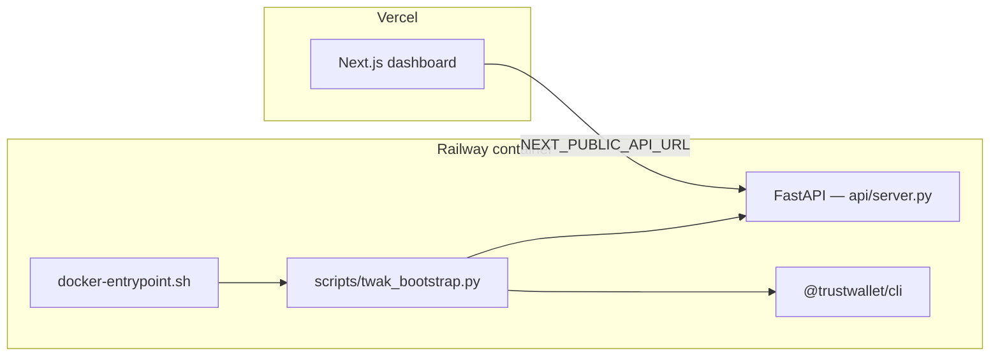
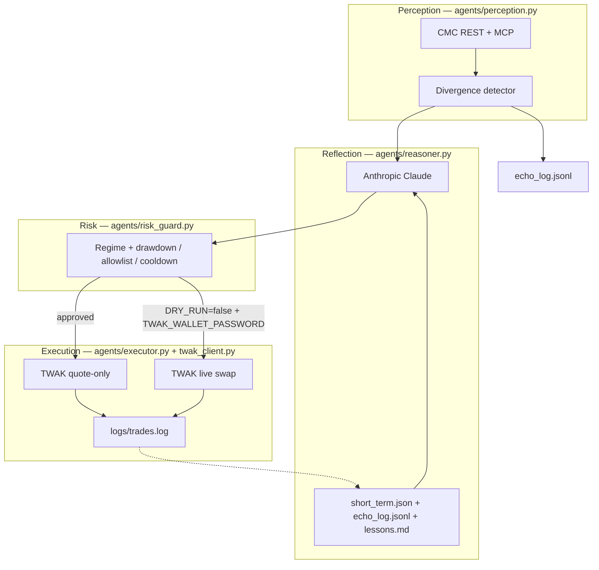
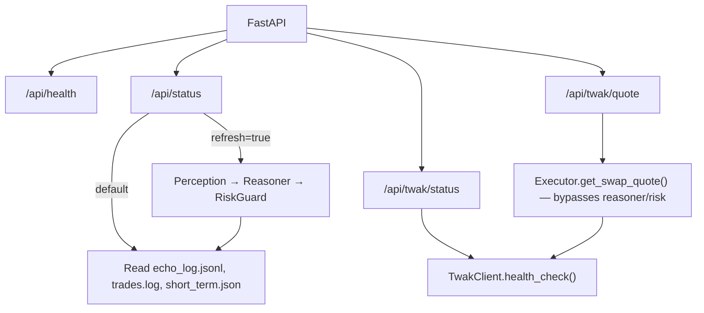

# EchoTrader

**The Reflexive Market Mirror Agent** — perceives where hype, on-chain reality, and macro vibes diverge, reasons with persistent memory, and executes measured positions autonomously via Trust Wallet Agent Kit (TWAK).

> Not another RSI-cross bot. EchoTrader echoes contradictions back at the market and only moves when the risk picture looks clean.

## Architecture

EchoTrader splits into two runtimes that share the same agent modules under `agents/`:

| Runtime | Entry point | What it does |
|---------|-------------|--------------|
| **Production API** | `api/server.py` (Railway) | Serves the dashboard, TWAK health/quotes, reads persisted state |
| **Agent orchestrator** | `main.py` (local or future cron) | Full loop: perceive → reason → risk → execute |

Railway runs the API only. The autonomous trading loop is not started by the container — run `python main.py` locally or wire a scheduled worker when you want continuous execution.

### Deployment topology



On startup, Railway bootstraps TWAK credentials and ensures a BSC wallet exists before the API listens. No `main.py` process runs in this container.

### Agent pipeline (shared core)

Used end-to-end by `main.py`. Partially used by the API when `/api/status?refresh=true`.



### API request paths (Railway)



`/api/status` does not execute trades. `/api/twak/quote` fetches a live BSC quote directly — useful for dry-run demos without running the full pipeline.

**Dry-run default (`DRY_RUN=true`):** the orchestrator and executor return real TWAK quotes (`--quote-only`). No wallet password or on-chain signing until you set `DRY_RUN=false` and `TWAK_WALLET_PASSWORD`.

## What Makes It Different

| Layer | Capability |
|-------|------------|
| **Perception** | Fear & Greed, global metrics, derivatives positioning, divergence detection |
| **Reflection** | Chain-of-thought thesis with 7-day echo memory + long-term lessons |
| **Risk** | Regime classification (bull/bear/choppy/high-vol/squeeze), hard guardrails |
| **Execution** | TWAK (`@trustwallet/cli`) — live quotes on BSC; swaps when `DRY_RUN=false` |
| **Personality** | Chatty reasoning output — explains trades like a sharp trader buddy |
| **Learning** | Post-trade PnL review appends to `memory/lessons.md` |

## Sponsor Stack

- **CoinMarketCap Agent Hub** — MCP (`https://mcp.coinmarketcap.com/mcp`) + optional x402 pay-per-request
- **Trust Wallet Agent Kit (TWAK)** — wallet, signing, swaps, x402 payments
- **BNB AI Agent SDK** — on-chain identity registration (optional, `bnbagent` extra)
- **Anthropic Claude** — default reasoner (`claude-sonnet-4-6`)

## Quick Start

### Prerequisites

- Python 3.11+
- [CoinMarketCap API key](https://pro.coinmarketcap.com/login)
- [TWAK credentials](https://portal.trustwallet.com/)
- Anthropic API key

### Install

```bash
cd EchoTrader
python -m venv .venv

# Windows
.venv\Scripts\activate

# macOS/Linux
source .venv/bin/activate

pip install -e ".[dev]"
cp .env.example .env
# Edit .env with your keys
```

### TWAK Setup

```bash
# Install CLI (local dev)
npm install -g @trustwallet/cli

# Credentials from https://portal.trustwallet.com/dashboard/apps
twak init --api-key <TWAK_ACCESS_ID> --api-secret <TWAK_HMAC_SECRET>

# Optional — only needed for live swaps (DRY_RUN=false)
twak wallet create --password <your-password>
```

For dry-run quotes, `TWAK_ACCESS_ID` + `TWAK_HMAC_SECRET` are sufficient. Wallet password is not required.

### Run

```bash
# Single dry-run cycle (safe default)
python main.py --once

# Continuous loop
python main.py
```

Set `DRY_RUN=false` in `.env` only when you are ready for live execution.

## Project Structure

```
EchoTrader/
├── main.py                   # Orchestrator loop
├── api/server.py             # FastAPI dashboard API
├── config/settings.py        # Env vars + guardrails
├── agents/
│   ├── perception.py         # CMC REST/MCP + divergence detection
│   ├── reasoner.py           # LLM brain with memory
│   ├── risk_guard.py         # Regime + limits
│   ├── twak_client.py        # TWAK CLI wrapper
│   └── executor.py           # Quote + swap execution
├── echotrader-frontend/      # Next.js dashboard (Vercel)
├── scripts/                  # Railway deploy, TWAK bootstrap, demo trades
├── memory/
│   ├── short_term.json       # Last 7 days of echoes
│   └── lessons.md            # What worked in past regimes
├── logs/trades.log           # Execution audit trail
├── Dockerfile                # Railway image (Python + @trustwallet/cli)
└── tests/
```

## Deployment

| Component | Target | Process | URL / config |
|-----------|--------|---------|--------------|
| Dashboard API | Railway | `docker-entrypoint.sh` → TWAK bootstrap → `python -m api.server` | `https://<service>.up.railway.app` |
| Frontend | Vercel | Next.js static/SSR | Set `NEXT_PUBLIC_API_URL` to Railway host |
| Agent loop | Local (or future cron) | `python main.py` / `python main.py --once` | Not started by Railway container |

API endpoints: `/api/health`, `/api/status` (add `?refresh=true` for live perception + reasoning), `/api/twak/status`, `/api/twak/quote`

## Guardrails (Configurable via `.env`)

| Variable | Default | Purpose |
|----------|---------|---------|
| `DRY_RUN` | `true` | Simulate trades until explicitly disabled |
| `MAX_DAILY_DRAWDOWN_PCT` | `3.0` | Halt trading after daily loss threshold |
| `MAX_POSITION_SIZE_PCT` | `5.0` | Cap per-trade size |
| `COOLDOWN_MINUTES` | `60` | Minimum gap between executions |
| `TOKEN_ALLOWLIST` | `BNB,ETH,USDT,USDC` | Only trade approved tokens |
| `TWAK_ACCESS_ID` | — | Trust Wallet API access ID (quotes + swaps) |
| `TWAK_HMAC_SECRET` | — | Trust Wallet HMAC secret |
| `TWAK_WALLET_PASSWORD` | — | Optional until `DRY_RUN=false` |
| `TWAK_CHAIN` | `bsc` | Execution chain (BNB Smart Chain) |

## Testing

```bash
pytest
```

## Demo Output Example

```
Social is frothy on BNB but funding just flipped crowded-long
and OI is stacking into fear territory. Smells like a squeeze
setup, not a clean entry — sitting at 0% size.
[trending_bull] contradictions: hype vs flow -> hold  at 0.0% size
```

## Roadmap

- [x] Web dashboard (Next.js + FastAPI)
- [x] TWAK live quotes on BSC (dry-run default)
- [x] Railway backend deployment
- [ ] Full CMC MCP coverage (derivatives, trending on higher plan tiers)
- [ ] x402 autonomous CMC payment via TWAK
- [ ] BNB Agent SDK ERC-8004 identity registration
- [ ] Reasoning hash anchoring (IPFS or on-chain)

## License

MIT