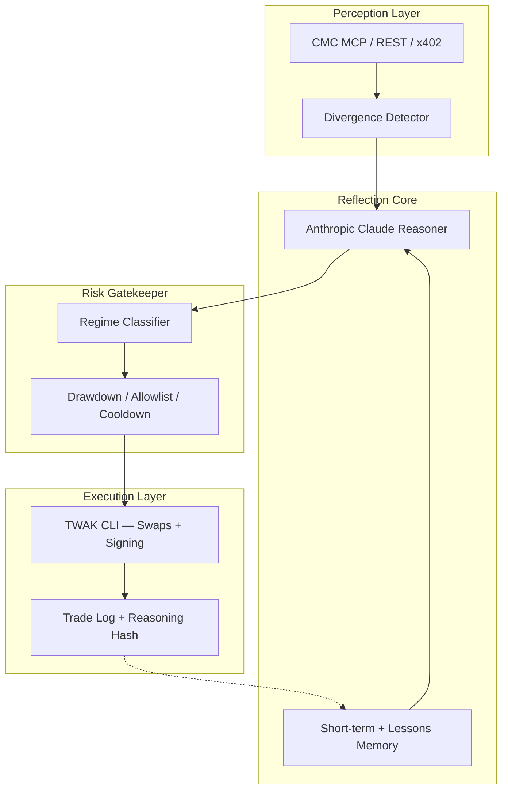

# EchoTrader

**The Reflexive Market Mirror Agent** — perceives where hype, on-chain reality, and macro vibes diverge, reasons with persistent memory, and executes measured positions autonomously via Trust Wallet Agent Kit (TWAK).

> Not another RSI-cross bot. EchoTrader echoes contradictions back at the market and only moves when the risk picture looks clean.

## Architecture



## What Makes It Different

| Layer | Capability |
|-------|------------|
| **Perception** | Fear & Greed, global metrics, derivatives positioning, divergence detection |
| **Reflection** | Chain-of-thought thesis with 7-day echo memory + long-term lessons |
| **Risk** | Regime classification (bull/bear/choppy/high-vol/squeeze), hard guardrails |
| **Execution** | TWAK autonomous swaps on BSC/EVM with dry-run safety default |
| **Personality** | Chatty reasoning output — explains trades like a sharp trader buddy |
| **Learning** | Post-trade PnL review appends to `memory/lessons.md` |

## Sponsor Stack

- **CoinMarketCap Agent Hub** — MCP (`https://mcp.coinmarketcap.com/mcp`) + optional x402 pay-per-request
- **Trust Wallet Agent Kit (TWAK)** — wallet, signing, swaps, x402 payments
- **BNB AI Agent SDK** — on-chain identity registration (optional, `bnbagent` extra)
- **Anthropic Claude** — default reasoner (`claude-sonnet-4-20250514`)

## Quick Start

### Prerequisites

- Python 3.11+
- [CoinMarketCap API key](https://pro.coinmarketcap.com/login)
- [TWAK credentials](https://portal.trustwallet.com/)
- Anthropic API key

### Install

```bash
cd EchoTrader
python -m venv .venv

# Windows
.venv\Scripts\activate

# macOS/Linux
source .venv/bin/activate

pip install -e ".[dev]"
cp .env.example .env
# Edit .env with your keys
```

### TWAK Setup

```bash
# macOS/Linux or WSL on Windows
curl -fsSL https://agent-kit.trustwallet.com/install.sh | bash
twak auth login
twak wallet create --password <your-password>
```

### Run

```bash
# Single dry-run cycle (safe default)
python main.py --once

# Continuous loop
python main.py
```

Set `DRY_RUN=false` in `.env` only when you are ready for live execution.

## Project Structure

```
EchoTrader/
├── main.py                 # Orchestrator loop
├── config/settings.py      # Env vars + guardrails
├── agents/
│   ├── perception.py       # CMC data + divergence detection
│   ├── reasoner.py         # LLM brain with memory
│   ├── risk_guard.py       # Regime + limits
│   └── executor.py         # TWAK integration
├── memory/
│   ├── short_term.json     # Last 7 days of echoes
│   └── lessons.md          # What worked in past regimes
├── logs/trades.log         # Execution audit trail
├── tests/                  # Unit tests
└── demo/                   # Screenshots + video assets
```

## Guardrails (Configurable via `.env`)

| Variable | Default | Purpose |
|----------|---------|---------|
| `DRY_RUN` | `true` | Simulate trades until explicitly disabled |
| `MAX_DAILY_DRAWDOWN_PCT` | `3.0` | Halt trading after daily loss threshold |
| `MAX_POSITION_SIZE_PCT` | `5.0` | Cap per-trade size |
| `COOLDOWN_MINUTES` | `60` | Minimum gap between executions |
| `TOKEN_ALLOWLIST` | `BNB,ETH,USDT,USDC` | Only trade approved tokens |

## Testing

```bash
pytest
```

## Demo Output Example

```
Social is frothy on BNB but funding just flipped crowded-long
and OI is stacking into fear territory. Smells like a squeeze
setup, not a clean entry — sitting at 0% size.
[trending_bull] contradictions: hype vs flow -> hold  at 0.0% size
```

## Roadmap

- [ ] Live CMC MCP tool calls (derivatives, on-chain, narratives)
- [ ] x402 autonomous CMC payment via TWAK
- [ ] BNB Agent SDK ERC-8004 identity registration
- [ ] Reasoning hash anchoring (IPFS or on-chain)
- [ ] Web dashboard for thesis, portfolio, echo history

## License

MIT