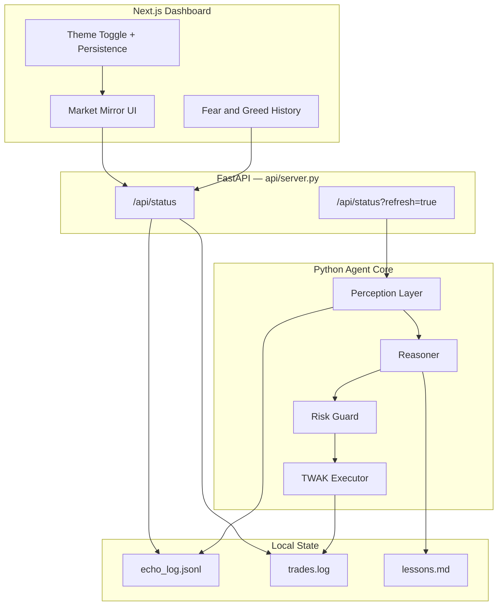
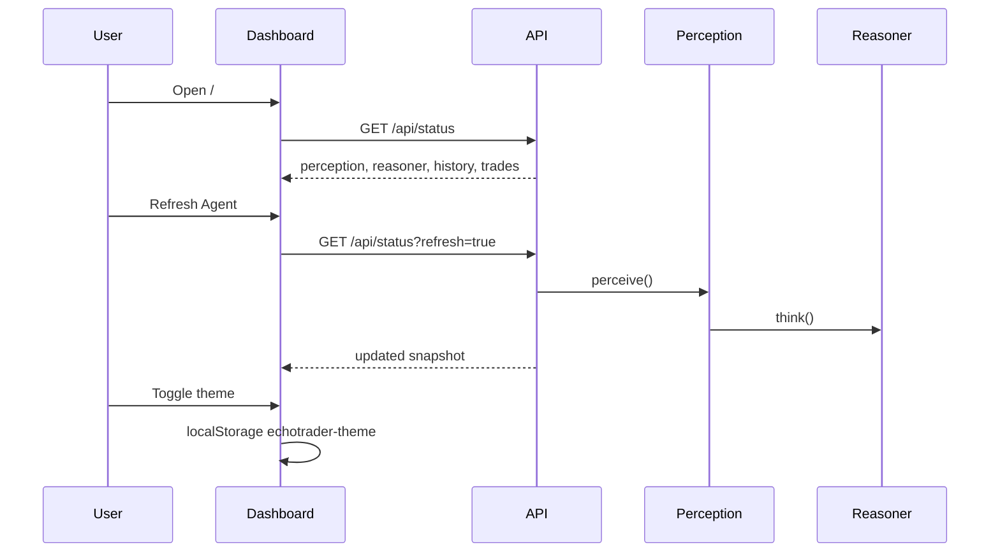

# EchoTrader Dashboard

Production frontend for the EchoTrader reflexive market mirror agent. Institutional dark/light themes, live perception history, and execution transparency.

**Live:** https://echotrader.vercel.app

## Architecture



## Data Flow



## Local Development

```bash
# Terminal 1 — Python API (repo root)
python -m api.server

# Terminal 2 — Dashboard
npm install
cp .env.example .env.local
npm run dev
```

Open http://localhost:3000

## Environment Variables

| Variable | Required | Description |
|----------|----------|-------------|
| `NEXT_PUBLIC_API_URL` | Yes | FastAPI backend URL (e.g. `http://localhost:8000`) |

No API keys belong in the frontend. All secrets stay in the Python backend `.env`.

## Brand Assets

| Asset | Path | Purpose |
|-------|------|---------|
| Favicon | `public/icon.svg` | Browser tab — echo mirror mark |
| Apple icon | `public/apple-icon.svg` | iOS home screen |
| Open Graph | `public/og.svg` | Social / link previews |

## Deploy to Vercel

1. Import with root directory `echotrader-frontend`
2. Set in Vercel dashboard:
   - `NEXT_PUBLIC_SITE_URL` = `https://echotrader.vercel.app`
   - `NEXT_PUBLIC_API_URL` = your deployed FastAPI host
3. Add to backend `.env`: `CORS_ORIGINS=https://echotrader.vercel.app`
4. Deploy — `npm run build` verified locally

`vercel.json` included. Theme preference persists client-side via `localStorage`.